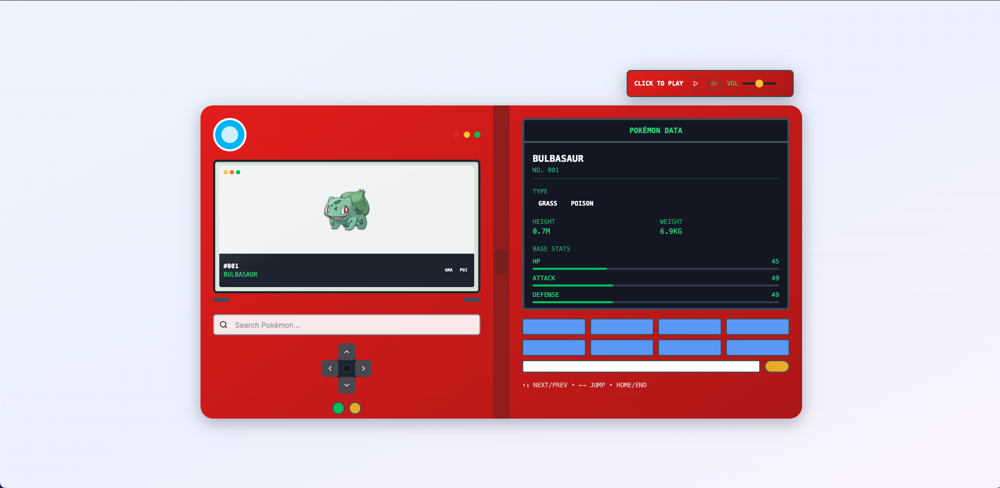
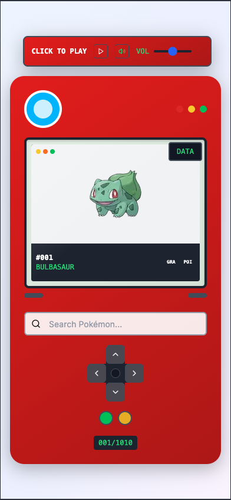
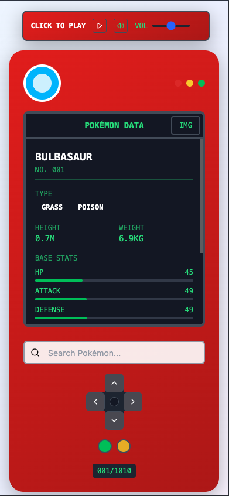

<!-- PROJECT SHIELDS -->
[![Contributors][contributors-shield]][contributors-url]
[![Forks][forks-shield]][forks-url]
[![Stargazers][stars-shield]][stars-url]
[![Issues][issues-shield]][issues-url]
[![LinkedIn][linkedin-shield]][linkedin-url]

<!-- PROJECT LOGO -->
<br />
<p align="center">
  <h3 align="center">Pokédex V2</h3>

  <p align="center">
    A modern and interactive Pokédex built with Next.js 14 + TypeScript + Tailwind CSS.
    <br />
    <a href="https://pokedex-v2-antonio-s.vercel.app/"><strong>Open the app »</strong></a>
    <br />
    <br />
    <a href="https://pokedex-v2-antonio-s.vercel.app/">View Demo</a>
    ·
    <a href="https://github.com/Tonybsilva-dev/Pokedex-V2">Repository</a>
    ·
    <a href="https://github.com/Tonybsilva-dev/Pokedex-V2/issues">Report Bug / Feature</a>
  </p>
</p>

## About The Project

Pokédex-inspired interface focused on performance, accessibility, and UX. It consumes PokeAPI data and offers search by name/ID, pagination, and Pokémon details.

### Stack

- Next.js 14, TypeScript, Tailwind CSS, Framer Motion
- Axios, Lucide React

### Screenshots

<p align="center">
  
  <br/>
  
  
  <br/>
  <sub>Demo images of the interface (desktop and mobile).</sub>
</p>

## Getting Started

To run locally:

### Prerequisites

- Node.js 18+
- npm (or pnpm/yarn)

### Installation

1. Clone the repository

   ```bash
   git clone https://github.com/Tonybsilva-dev/Pokedex-V2.git
   cd Pokedex-V2
   ```

2. Install dependencies

   ```bash
   npm install
   ```

3. Run the project

   ```bash
   npm run dev
   ```

4. Open in the browser

   ```
   http://localhost:3000
   ```

## Usage

- Access the hosted demo: `https://pokedex-v2-antonio-s.vercel.app/`
- Search by name or ID (e.g., "025" for Pikachu)

## Roadmap

See the [open issues](https://github.com/Tonybsilva-dev/Pokedex-V2/issues) for upcoming items and known bugs.

### Author

<table>
  <tr>
    <td align="center"><a href="https://github.com/Tonybsilva-dev"><br /><sub><b>Antonio Silva</b></sub></a><br /><a href="https://github.com/Tonybsilva-dev/Pokedex-V2/commits?author=Tonybsilva-dev" title="Commits">📦</a> <a href="https://github.com/Tonybsilva-dev/Pokedex-V2/pulls?q=is%3Apr+reviewed-by%3ATonybsilva-dev" title="Reviewed PRs">👀</a></td>
  </tr>
</table>

### Contributors

<table>
  <tr>
    <td>Contributions are welcome via PR.</td>
  </tr>
</table>

## License

Distributed under the MIT license. See `LICENSE` for more information.

---

⭐ If this project helped you, please consider giving it a star!

<!-- MARKDOWN LINKS & IMAGES -->
[contributors-shield]: https://img.shields.io/github/contributors/Tonybsilva-dev/Pokedex-V2.svg?style=for-the-badge
[contributors-url]: https://github.com/Tonybsilva-dev/Pokedex-V2/graphs/contributors
[forks-shield]: https://img.shields.io/github/forks/Tonybsilva-dev/Pokedex-V2.svg?style=for-the-badge
[forks-url]: https://github.com/Tonybsilva-dev/Pokedex-V2/network/members
[stars-shield]: https://img.shields.io/github/stars/Tonybsilva-dev/Pokedex-V2.svg?style=for-the-badge
[stars-url]: https://github.com/Tonybsilva-dev/Pokedex-V2/stargazers
[issues-shield]: https://img.shields.io/github/issues/Tonybsilva-dev/Pokedex-V2.svg?style=for-the-badge
[issues-url]: https://github.com/Tonybsilva-dev/Pokedex-V2/issues
[linkedin-shield]: https://img.shields.io/badge/-LinkedIn-black.svg?style=for-the-badge&logo=linkedin&colorB=555
[linkedin-url]: https://linkedin.com/in/tony-silva/
